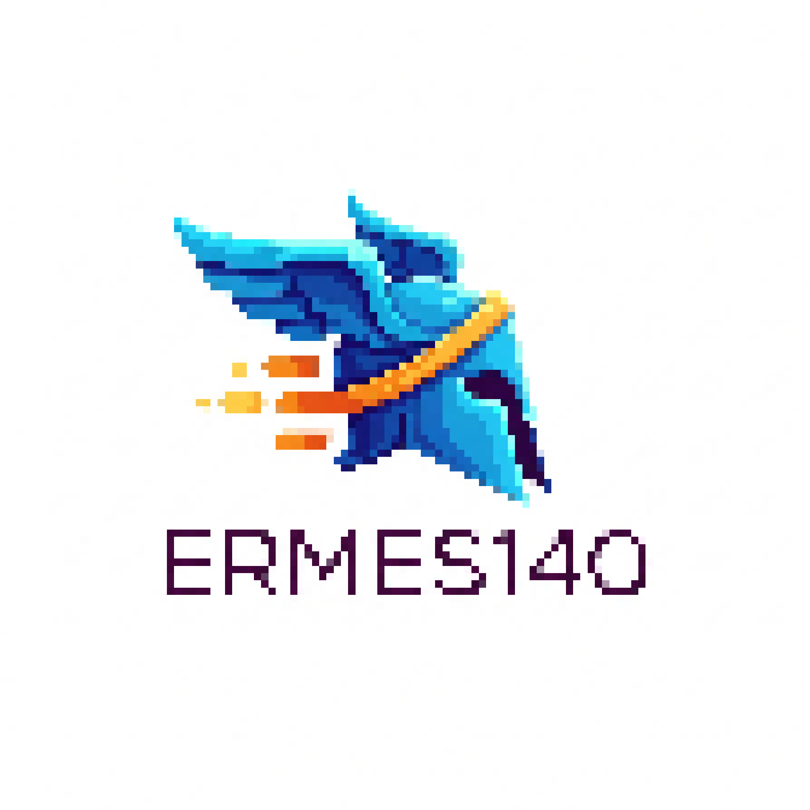
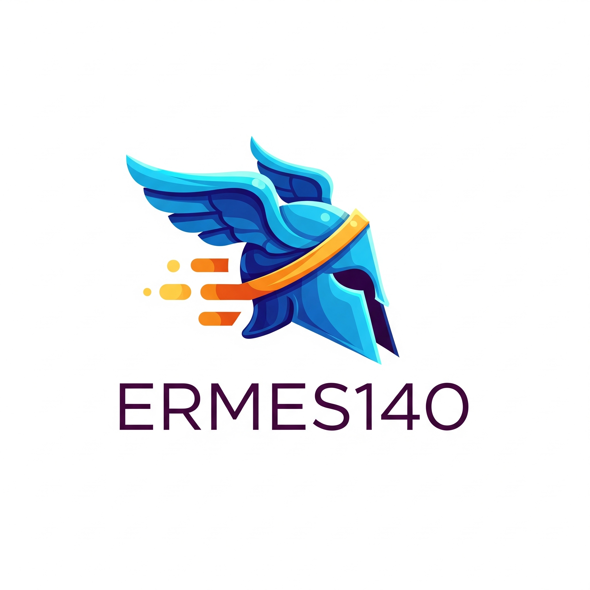

# ERMES140

 <!-- Replace with the actual path to your logo -->

Ermes140 is a CLI program written in C for audio processing. With this program, you'll be able to:

- Record, compress, and export audio.
- Remove noise from audio files.
- Reproduce audio directly from the CLI.
- Identify musical notes from audio files.
- Create and manage multiple profiles.
- Organize your library of audio and note files.
- Visualize audio recordings and playback in a graphical CLI interface.

---

## Features

- **Audio Recording**: Capture high-quality audio directly from your device.
- **Noise Reduction**: Clean up your recordings with advanced noise removal.
- **Audio Compression**: Save space without compromising quality.
- **Note Identification**: Analyze audio to detect musical notes.
- **Library Management**: Keep your audio and note files organized.
- **Graphical CLI Interface**: Enjoy a visually appealing CLI experience.

---

## MANAGE YOUR SOUND

[](public/Hermes_Audio_Software_Video.mp4) <!-- Replace with the actual path to your video and thumbnail -->

Click the image above to watch a brief fun video.

---

## Installation

1. Clone the repository:
   ```bash
   git clone https://github.com/giusber2005/Ermes140.git
   ```
2. Navigate to the project directory:
   ```bash
   cd Ermes140
   ```
3. Build the project:
   ```bash
   make
   ```

---

## Usage

Run the program using:
```bash
./ermes140 [options]
```

For a list of available options, use:
```bash
./ermes140 --help
```

---

## Contributing

Contributions are welcome! Please fork the repository and submit a pull request.

---

## License

This project is licensed under the [MIT License](LICENSE).

---

## Contact

For any inquiries or feedback, feel free to reach out at [giusber2005@gmail.com](mailto:giusber2005@gmail.com).
